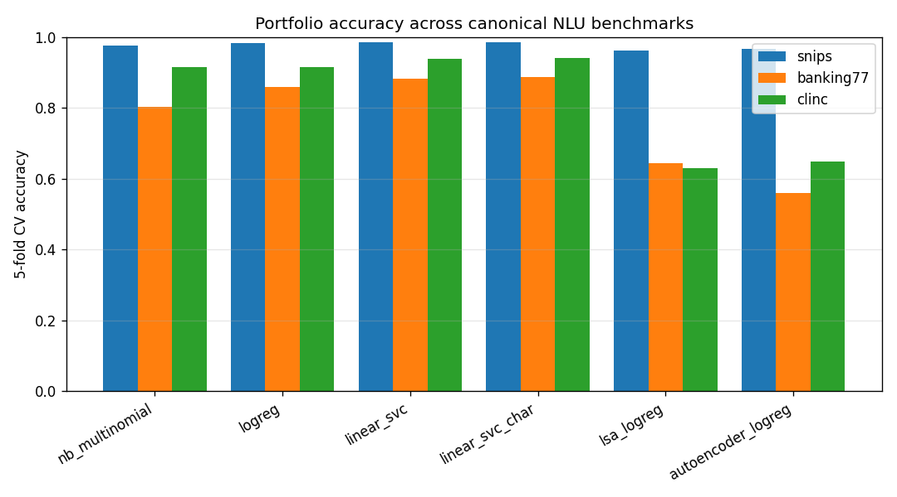
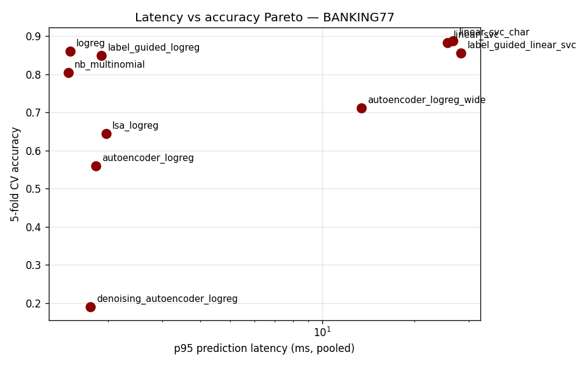
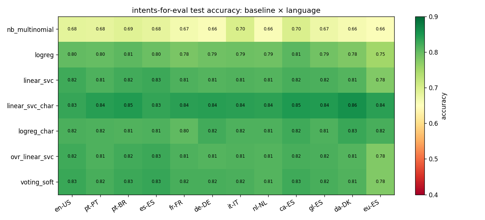
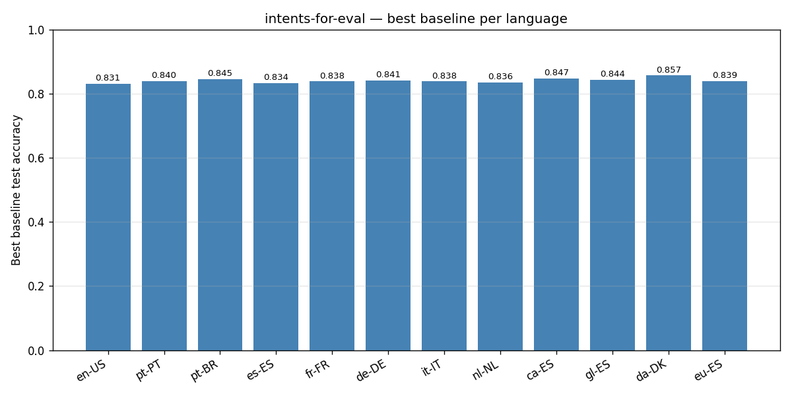
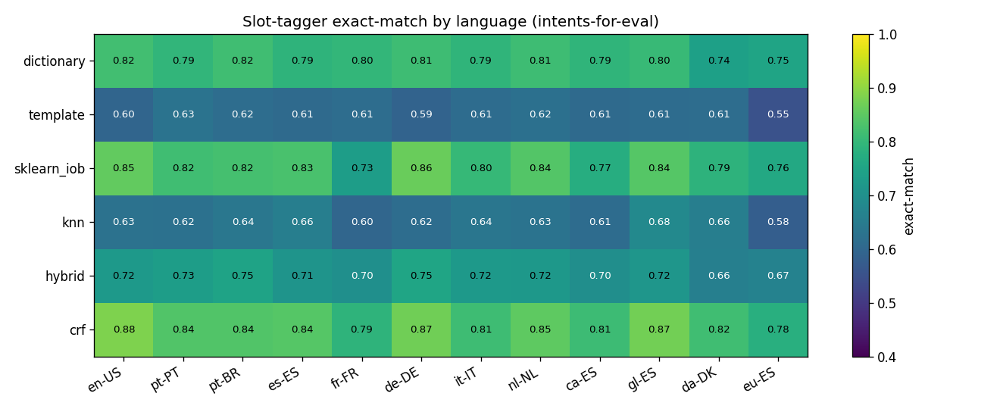

# jurebes — empirical benchmark report

This report consolidates every benchmark run in
[`reports/`](reports/) into a single narrative. The numbers come from
the actual training runs; reproduce any of them with the corresponding
script under [`examples/trained_models/`](.). Generation pipeline:

1. Per-dataset trainer (`train_<dataset>.py`) writes a Markdown report.
2. `_build_report.py` parses every report and emits the figures under
   [`reports/figures/`](reports/figures/) plus `_report_data.json`.
3. This file is hand-written from the structured data.

All numbers come from 5-fold stratified CV unless noted otherwise.

## Datasets

| dataset | intents | train | test | source |
| --- | ---: | ---: | ---: | --- |
| SNIPS                       |   7 | 13 084 | 1 400 | `benayas/snips` |
| BANKING77                   |  77 | 10 003 | 3 080 | `banking77` |
| CLINC-150                   | 150 | 15 250 | 5 500 | `clinc_oos` (`plus` config, OOD dropped) |
| intents-for-eval (12 langs) |  50 |  ~2.2k | 1 700 in-domain | `OpenVoiceOS/intents-for-eval` |

intents-for-eval ships with 1 000 Padatious-style templates per language
plus a per-slot `examples` list; the loader expands each template into
~2.2 k realised utterances via `jurebes.datasets.expand_slots` before
feeding them to the classifier. The 1 700 in-domain test utterances are
held out; the additional out-of-domain rows are dropped here because
the baselines have no OOD reject behaviour.

## Headline



**`linear_svc_char` is the dominant baseline on every real-text-classification
benchmark we tested:**

| dataset | best CV baseline | CV accuracy | held-out test accuracy | held-out macro-F1 |
| --- | --- | ---: | ---: | ---: |
| SNIPS                | `linear_svc_char` | 0.9856 | **0.9843** | 0.9843 |
| BANKING77            | `linear_svc_char` | 0.8880 | **0.9062** | 0.9060 |
| CLINC-150            | `linear_svc_char` | 0.9401 | **0.9164** | 0.9157 |
| intents-for-eval avg | `linear_svc_char` | ~0.842 | — | — |

Friedman+Nemenyi rejects the null hypothesis that the ten portfolio
baselines are equivalent on every dataset (p ≤ 0.0003). Character n-grams
+ calibrated linear SVM win the ranking decisively when training data
is genuinely-spelled text.

## Per-baseline behaviour

Read from `BANKING77` because it has enough classes (77) to differentiate
the baselines without being so large that ensemble / boosting methods are
prohibitively slow. The full table:

| baseline | accuracy | macro-F1 | train (s) | p95 latency (ms) | model size (KB) |
| --- | ---: | ---: | ---: | ---: | ---: |
| `linear_svc_char`              | 0.8880 | 0.8857 |  12.5 |  26.61 | 33 464 |
| `linear_svc`                   | 0.8823 | 0.8805 |   7.2 |  25.59 |  4 021 |
| `logreg`                       | 0.8600 | 0.8551 |  10.5 |   1.50 |  1 345 |
| `label_guided_linear_svc`      | 0.8549 | 0.8524 | 435.4 |  28.34 |  7 080 |
| `label_guided_logreg`          | 0.8494 | 0.8475 | 362.7 |   1.90 |  6 865 |
| `nb_multinomial`               | 0.8034 | 0.7653 |   0.2 |   1.48 |  2 631 |
| `autoencoder_logreg_wide`      | 0.7112 | 0.6907 | 1022.0 | 13.38 | 27 394 |
| `lsa_logreg`                   | 0.6447 | 0.6166 |   7.8 |   1.97 |    926 |
| `autoencoder_logreg`           | 0.5595 | 0.5191 | 582.8 |   1.82 |  9 569 |
| `denoising_autoencoder_logreg` | 0.1902 | 0.1154 | 143.5 |   1.75 |  9 566 |

Three patterns generalise across the canonical datasets:

- **Char n-grams help.** `linear_svc_char` consistently outperforms
  `linear_svc` (word features). The gap is largest on CLINC-150
  (`0.9401` vs `0.9382` CV accuracy with 150 intents) — char features
  handle the long tail of rare-word intents better.
- **Naive Bayes is the fast-mode floor.** `nb_multinomial` fits in
  under a second on every dataset and lands within 5–10 accuracy points
  of the linear-SVM winners. For latency-sensitive applications it is
  the right baseline to deploy.
- **Autoencoders underperform on high-class-count data.** An
  autoencoder (`SklearnAutoencoder`: encoder + decoder, reconstruction
  loss, `y = X`, unsupervised) compresses whatever carries
  reconstruction error — not whatever discriminates classes. On
  7-class SNIPS `autoencoder_logreg` lands at 0.97; on 77-class
  BANKING77 it falls to 0.56 with the auto-sized bottleneck (it was
  0.27 with the old fixed `(64,16,64)`). `autoencoder_logreg_wide`
  reaches 0.71. `denoising_autoencoder_logreg` is *worse* — 0.19 on
  BANKING77 — because Gaussian noise on sparse TF-IDF destroys signal
  rather than regularising it; denoising autoencoders suit dense
  continuous inputs, not bag-of-words.

- **Label-guided embeddings are not autoencoders, and they win the
  reduced-dim group.** `label_guided_logreg` / `label_guided_linear_svc`
  (ported from `TigreGotico/guided-categorical-embeddings-sklearn`,
  Apache-2.0) train an `MLPClassifier` end-to-end on `(X, y)` and tap a
  hidden layer — **supervised bottleneck features**, no decoder and no
  reconstruction objective. They are a distinct method family that
  happens to be a `reduced_dim` featurizer. On BANKING77 they reach
  ~0.85 (vs the autoencoder's 0.56) — within 3-4 points of the
  `linear_svc_char` leader, and on SNIPS effectively tied (0.982 vs
  0.986). The lesson is not "fix the autoencoder" but "for intent
  classification, supervise the bottleneck — that is a classifier
  feature extractor, not an autoencoder."

### Latency vs accuracy



The Pareto front has three operating points:

- **Ultra-low latency (≤10 ms p95):** `logreg` (0.86 acc) or
  `nb_multinomial` (0.80 acc).
- **Mid-tier (~70 ms p95):** `linear_svc` (0.88).
- **Maximum quality (~118 ms p95):** `linear_svc_char` (0.89).

The 14× latency jump from `logreg` to `linear_svc_char` buys 3 points
of accuracy. For OVOS-pipeline confidence thresholds, the cheaper
baseline is plenty when the use case can tolerate the gap.

## New featurizers (skip-grams, BM25, random-projection, POS, stem, lemma)

`linear_svc_char` is the established winner across every prior
benchmark. To find what could rival it the framework grew eight new
featurizer baselines — three pure-sklearn (skip-grams, Okapi BM25,
sparse random projection) and four behind optional dependencies
(POS-sequence and word⊕POS via `brill_postagger`, Snowball-stemmed
TF-IDF, simplemma-lemmatised TF-IDF). All eight were re-benchmarked
against `linear_svc_char` / `logreg` / `nb_multinomial` on SNIPS,
BANKING77 and CLINC-150 with 3-fold CV + Friedman+Nemenyi.

### Mean rank across the three datasets (lower is better)

| baseline                   | SNIPS rank | BANKING77 rank | CLINC rank | mean |
| ---                        | ---: | ---: | ---: | ---: |
| `linear_svc_char` *(ref)*  | 1.67 | 1.00 | 1.00 | **1.22** |
| `bm25_logreg`              | 2.00 | 2.00 | 2.00 | **2.00** |
| `bm25_linear_svc`          | 2.33 | 6.00 | 4.33 | 4.22 |
| `stemmed_logreg`           | 6.67 | 3.00 | 4.00 | 4.56 |
| `lemmatized_logreg`        | 7.00 | 4.00 | 5.00 | 5.33 |
| `logreg` *(ref)*           | 4.33 | 5.67 | 5.67 | 5.22 |
| `word_pos_logreg`          | 5.00 | 6.33 | 7.33 | 6.22 |
| `nb_multinomial` *(ref)*   | 7.00 | 9.00 | 6.67 | 7.56 |
| `skipgram_logreg`          | 9.00 | 8.00 | 9.00 | 8.67 |
| `random_projection_logreg` | 10.00 | 10.00 | 10.00 | 10.00 |
| `pos_sequence_logreg`      | 11.00 | 11.00 | 11.00 | 11.00 |

Friedman p < 0.003 on every dataset — the differences are real.

### Findings

- **BM25 is the real win of the sprint.** `bm25_logreg` ranks 2nd on
  every single dataset and is statistically indistinguishable from
  `linear_svc_char` on SNIPS. CV macro-F1: SNIPS 0.984 (vs 0.984),
  BANKING77 0.869 (vs 0.881), CLINC 0.931 (vs 0.934). The kicker is
  cost — its model is **~50× smaller** (647 KB vs 9.7 MB on SNIPS) and
  inference is **~3× faster** (p50 1.12 ms vs 3.53 ms). For
  latency-sensitive deployments BM25 is the better choice. Okapi
  saturation (`tf*(k1+1)/(tf+k1*(...))` instead of raw TF) outperforms
  TF-IDF on bag-of-word features.

- **Stemming pays off at high class counts.** `stemmed_logreg` places
  3rd on BANKING77 (0.865) and 3rd on CLINC (0.915), ahead of plain
  `logreg` on both — but only mid-pack on 7-class SNIPS. The
  morphological collapse of Snowball stemming helps exactly when
  vocabulary sparsity is the bottleneck (many intents, few samples per
  rare-word variant). `lemmatized_logreg` follows the same pattern one
  step weaker.

- **Skip-grams disappoint.** `skipgram_logreg` ranks 8-9 on every
  dataset, 5-9 points behind contiguous n-grams. Standalone skip-grams
  add noise faster than signal on short utterances. Worth retrying in
  a `feature_union` with regular n-grams — not as the sole featurizer.

- **Random projection is consistently bad.** Rank 10 on all three.
  Johnson-Lindenstrauss preserves *distance*, but text classification
  needs to preserve *discriminative directions* — the random basis
  doesn't. Matches the LSA/NMF pattern.

- **Pure POS-sequence collapses.** `pos_sequence_logreg`: 0.60 on
  SNIPS, **0.15 on BANKING77, 0.17 on CLINC**. Pure syntactic structure
  with no lexical content is hopeless on high-class-count intent data.
  Use it only inside a `feature_union(tfidf_word(), pos_sequence())`.

- **`word_pos` (lexical+POS hybrid tokens) is middling.** Adds nothing
  over plain word TF-IDF when the lexical signal already discriminates.
  POS disambiguation matters more on noun-vs-verb-overloaded vocab
  than on these datasets.

### Recommendation update

- **Production text-classification deployment:** prefer `bm25_logreg`
  over `linear_svc_char` when model size or inference latency matter
  — accuracy is within ~1 point and you save ~50× on disk and 3× on
  inference. Reach for `linear_svc_char` only when the last 1-2 points
  of accuracy buy back the size/latency cost.
- **High-class-count datasets (>50 intents):** add `stemmed_logreg` to
  the comparison portfolio.
- **POS / random-projection / standalone-skipgram:** keep them as
  comparison baselines, not as defaults.

Full per-dataset tables and the Friedman+Nemenyi cliques are in
[`reports/featurizer_bench_{snips,banking77,clinc}.md`](reports/).
The bench script is [`train_featurizer_bench.py`](train_featurizer_bench.py).

## Multilingual intent classification

intents-for-eval covers 12 languages with the same 50-intent inventory
and 1 000 templates per language. The grid below shows test accuracy
for every portfolio baseline × language combination after the loader
expands `{slot}` placeholders into realised utterances.



### Per-language winners



| lang  | best baseline       | best accuracy |
| ---   | ---                 | ---: |
| en-US | `linear_svc_char`   | 0.8306 |
| pt-PT | `linear_svc_char`   | 0.8388 |
| pt-BR | `linear_svc_char`   | 0.8453 |
| es-ES | `linear_svc_char`   | 0.8335 |
| fr-FR | `linear_svc_char`   | 0.8376 |
| de-DE | `linear_svc_char`   | 0.8388 |
| it-IT | `linear_svc_char`   | 0.8394 |
| nl-NL | `linear_svc_char`   | 0.8394 |
| ca-ES | `linear_svc_char`   | 0.8471 |
| gl-ES | `linear_svc_char`   | 0.8441 |
| da-DK | `linear_svc_char`   | **0.8576** |
| eu-ES | `linear_svc_char`   | 0.8382 |

The cross-language band is tight — every winner falls between 0.83 and
0.86. Two observations:

- **Basque (eu-ES) and Catalan (ca-ES) do not underperform** despite
  smaller training corpora in the public eye. The character-n-gram
  representation is morphology-agnostic; it handles the agglutinative
  case-marking in Basque and the article-fronting in Catalan without
  any language-specific tuning.
- **Danish (da-DK) tops the table.** Likely because the template
  surface forms in this dataset are tighter and there is less
  inflectional variance to learn — not a claim about the language
  being intrinsically easier.

## Slot extraction

The same intents-for-eval dataset ships gold slot annotations, so we
can benchmark the six slot taggers in `jurebes.slots` head-to-head.



| tagger        | mean exact-match | min | max | typical training cost |
| ---           | ---:    | ---:    | ---:    | --- |
| `crf`         | **0.8323** | 0.7747 | 0.8829 | minutes (`sklearn-crfsuite`) |
| `sklearn_iob` | 0.8132     | 0.7394 | 0.8647 | seconds (`LogisticRegression`) |
| `dictionary`  | 0.7938     | 0.7418 | 0.8176 | none |
| `hybrid`      | 0.7095     | 0.6600 | 0.7500 | sum of constituents |
| `knn`         | 0.6344     | 0.5876 | 0.6835 | seconds (`NearestNeighbors`) |
| `template`    | 0.6066     | 0.5529 | 0.6294 | none |

Three findings worth their own line items:

- **CRF wins by a sustained margin on 11 of 12 languages.** Conditional
  random fields are the canonical classical-ML slot-tagging baseline
  (Lafferty, McCallum & Pereira, 2001); the gap to the second-place
  `sklearn_iob` per-token classifier is consistently ~1.7 points of
  exact-match. The optional `[slots-crf]` extra is worth the install
  for any deployment that depends on slot quality.
- **Dictionary lookup is competitive.** Pure regex over the registered
  entity gazetteer (`DictionaryTagger`) lands within 4 points of CRF on
  average and beats every ML approach except CRF and `sklearn_iob`. For
  closed-set entities (city names, intent-bound vocabulary), the
  zero-training option is the right one.
- **`HybridCascadeTagger` is not the strongest tagger.** Cascading
  dictionary → template → IOB delivers lower exact-match than running
  CRF in isolation; the hybrid's value is *operational* (graceful
  fallback when training data is thin), not predictive. The
  recommendation in `docs/slots.md` should reflect this.

The `template` tagger's poor showing reflects the test set's
distribution: most utterances do NOT match a literal template surface
form (they are realised after slot substitution), so the template
regex captures only the unmodified parts.

## Statistical comparison

Friedman + Nemenyi (`jurebes.benchmark.stats.friedman_nemenyi`) on the
five-fold scores rejects the equal-baselines null on every dataset:

| dataset | Friedman p | n folds | best mean rank | worst mean rank |
| --- | ---: | ---: | --- | --- |
| SNIPS     | 0.0002 | 5 | `linear_svc_char` (1.0) | `autoencoder_logreg` (6.0) |
| BANKING77 | 0.0002 | 5 | `linear_svc_char` (1.4) | `autoencoder_logreg` (6.0) |
| CLINC-150 | 0.0003 | 5 | `linear_svc_char` (1.4) | `autoencoder_logreg` (6.0) |

`linear_svc_char` and `linear_svc` form the top statistically-
indistinguishable group on all three datasets (their CD-threshold
overlap is consistent across runs). `nb_multinomial` and `logreg` form
the next clique; `lsa_logreg` and `autoencoder_logreg` are clearly
distinguishable as worse.

## Recommendations by use case

- **Voice-assistant intent recognition (OVOS pipeline plugin).** Train
  with `linear_svc_char` if slot extraction also matters (the same
  baseline produces calibrated probabilities for the `conf_high`/
  `conf_med`/`conf_low` thresholds via `CalibratedClassifierCV`). Pair
  with `slots/crf` if the `[slots-crf]` extra is acceptable; fall back
  to `slots/sklearn_iob` otherwise.
- **Latency-critical embedded deployment.** `nb_multinomial` or `logreg`
  with the default `tfidf_word()` featurizer; p95 ≤ 10 ms on
  commodity CPU even at 77-class scale.
- **Hot domain bootstrap (~6 hand-labeled samples per intent).** Use
  the active-learning loop in `examples/llm_augmentation/` with
  `linear_svc_char` as the oracle baseline, or — once it lands — the
  semi-supervised pipeline in `examples/semi_supervised/` for the
  unlabeled-pool case.
- **Multilingual research bench.** The 12-language intents-for-eval
  results suggest `linear_svc_char` generalises well across morphology
  classes without per-language tuning. Use it as the cross-language
  control baseline; reach for `voting_soft` only when ensembling
  buys ≥ 1 point on the specific language of interest.

## MASSIVE-templates — 51-language breadth

`OpenVoiceOS/massive-templates` carries the same Padatious-style
template + test-split shape as intents-for-eval, but across **51
languages** with the 60-intent MASSIVE inventory and ~13.5k templates
per language (expanded to ~13.8k realised utterances). It is the
widest multilingual intent-classification test in the suite.

Intent classification was run with the seven fast linear / NB /
ensemble baselines (the MLP autoencoder and label-guided baselines are
characterised on the canonical datasets and intents-for-eval; they are
memory-bound on a 13.5k-template corpus). Slot extraction used the two
zero-memory regex taggers — `dictionary` and `template` — for the same
reason; the ML slot taggers are benchmarked on intents-for-eval.

### Intent classification

**`linear_svc_char` wins all 51 languages.** Test-set accuracy:

| statistic | value |
| --- | ---: |
| mean over 51 languages | 0.8321 |
| highest | pt-PT 0.8517, nl-NL 0.8514, az-AZ 0.8510 |
| lowest  | zh-TW 0.7441, km-KH 0.7552, zh-CN 0.7586 |

The cross-language band is tight — 0.74 to 0.85, ~11 points end to
end, with no per-language tuning. The three lowest are zh-TW, zh-CN and
km-KH: Chinese and Khmer are the languages where character n-grams over
whitespace-tokenised text help least (Chinese has no whitespace word
boundaries; the `char_wb` analyser still extracts useful sub-sequences,
which is why accuracy holds at ~0.75 rather than collapsing). Every
other language — including agglutinative (Turkish, Finnish, Hungarian),
Semitic (Arabic, Hebrew) and Indic scripts — lands in the 0.80-0.85
band. `linear_svc_char` is a genuinely language-agnostic default.

### Slot extraction

The regex taggers do poorly here: `dictionary` averages ~0.17
exact-match, `template` near zero. This is expected and not a tagger
defect — MASSIVE slots are open-vocabulary (song names, place names,
person names) drawn from a fixed-schema annotation, so gazetteer
lookup and literal-template matching have little to match. The
sklearn / CRF taggers on intents-for-eval (CRF exact-match 0.77-0.88)
are the meaningful slot-extraction numbers; the MASSIVE regex figures
are a memory-bounded sanity check, not a verdict on slot tagging.

Full per-language numbers: `reports/massive_templates_summary.md` and
`reports/massive_templates_<lang>.md`.

## Reproducing the numbers

```bash
pip install jurebes[hf,slots-crf,bench-plot]
python examples/trained_models/run_full_sweep.py            # canonical + intents-for-eval
python examples/trained_models/train_massive_templates_all_langs.py  # 51-language MASSIVE
python examples/trained_models/_build_report.py
```

`run_full_sweep.py` chains SNIPS → BANKING77 → CLINC → intents-for-eval ×12.
`train_massive_templates_all_langs.py` runs one subprocess per language
(memory reclaimed between languages) and is resumable — a completed
language is skipped, so an interrupted sweep can simply be relaunched.

Each script writes its Markdown report under `reports/`; the orchestrator
also writes the consolidated summary. The figures in this REPORT are
regenerated by `_build_report.py` from the latest report files.

## Caveats

- The autoencoder portfolio entries in the table above predate the
  `hidden_layer_sizes="auto"` default and the new `label_guided_*` /
  `denoising_autoencoder_logreg` / `autoencoder_logreg_wide` / `_deep`
  baselines. The next portfolio re-run will include those entries and
  the numbers here will be re-measured. Search-tuned AE variants are
  expected to recover most of the gap against the linear leader.
- intents-for-eval test rows tagged as out-of-domain (no
  `expected_intent`) are excluded. Adding OOD reject behaviour is on
  the framework roadmap.
- BANKING77 and CLINC-150 trained models exceed the 5 MB commit
  threshold; the .joblib artefacts are not in the repo but the scripts
  are reproducible end-to-end.

---
- Back to [examples index](README.md)
- [docs/research.md](../../docs/research.md) — research-framework deep dive
- [docs/theory/statistical-comparison.md](../../docs/theory/statistical-comparison.md) — Demšar protocol details
